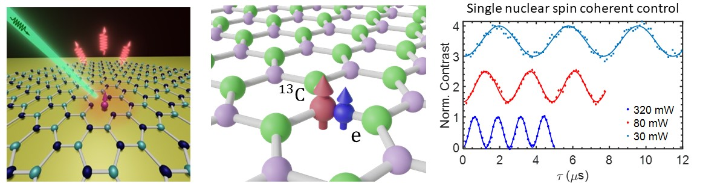
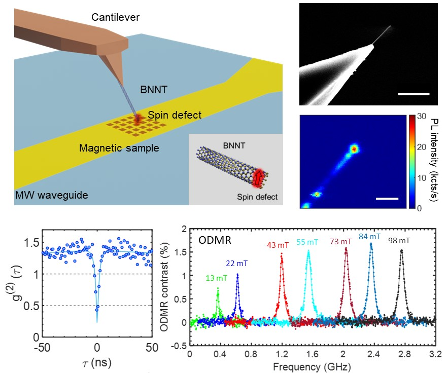
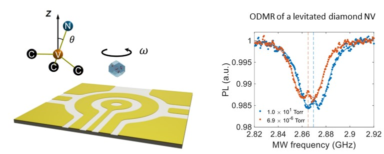
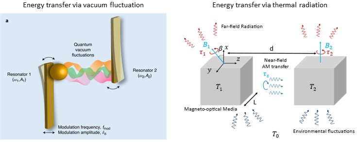



## Novel spin qubits in hexagonal boron nitride
Developing coherent control of individual quantum systems and harnessing this control to realize entanglement-based quantum devices is the central story of current quantum technologies.  Spin defects in solid state materials have recently emerged as one of the most promsing systems. A spin defect provides a spin–photon quantum interface that enables optical access to its electronic spins. The electron spins provide controllable qubits with long relaxation and coherence times.  While several spin defects have been well investigated, only a few defects in diamond and silicon carbide exhibit room temperature coherence properties.  

My research focuses on spin qubits in novel material platforms, specifically, in hexagonal boron nitride (hBN). hBN is a van der Waals material and its layered structure offers capabilities to integrate with heterogeneous nanodevices. We discover and create optically active spin defects in hBN, and study these defects using the optically detected magnetic resonance (ODMR) technique. Our investigations include $$V_B^-$$ spin defect ensembles and single carbon-related defects in hBN. Additionally, we leverage these defects to detect, polarize and control the surrounding nuclear spins. The nuclear spins generally exhibit significantly longer coherence times compared to electronic spins.  The capability of controlling nuclear spins enables long-live nucelar spin quantum registers, which can overcome the short coherence time of hBN spin defects.

__Related publications__:
* __Gao, Xingyu__*, Sumukh Vaidya*, Kejun Li, Saakshi Dikshit, Shimin Zhang, Peng Ju, Kunhong Shen, Yuanbin Jin, Yuan Ping, and Tongcang Li. "An optically addressable electronuclear spin register in hexagonal boron nitride." (in preparation).
* __Gao, X.__, Vaidya, S., Li, K., Ju, P., Jiang, B., Xu, Z., Allcca, A. E., ..., Bhave, S. A., Chen, Y. P., Ping, Y., & Li, T. Nuclear spin polarization and control in hexagonal boron nitride. Nature Materials, 21, 1024-1028 (2022).
* Gong, R., He, G., __Gao, X.__, Ju, P., Liu, Z., Ye, B., Henriksen, E. A., Li, T., & Zu, C. Coherent Dynamics of Strongly Interacting Electronic Spin Defects in Hexagonal Boron Nitride. Nature Communications 14, 3299 (2023).
* Mathur, N., Mukherjee, A., __Gao, X.__, Luo, J., McCullian, B. A., Li, T., Vamivakas, A. N. & Fuchs, G. D. Excitedstate spin-resonance spectroscopy of $$V_B^-$$ defect centers in hexagonal boron nitride. Nature Communications, 13, 3233 (2022).
* __Gao, X.__, Jiang, B., ... & Li, T. High-contrast plasmonic-enhanced shallow spin defects in hexagonal boron nitride for quantum sensing. Nano Letters, 21, 7708-7714 (2021).
* __Gao, X.__, Pandey, S., Kianinia, M., Ahn, J., Ju, P., Aharonovich, I., ... & Li, T. Femtosecond laser writing of spin defects in hexagonal boron nitride. ACS Photonics, 8, 994-1000 (2021).

## Quantum-enhanced sensing using spin defects
Solid-state spin defects have been demonstrated as promising sensors, known as quantum sensors, for probing localized physical quantities, including magnetic and electric fields, tempearture and strain. Compared to the conventional sensors, the quantum sensor utilizes the spin coherence and entanglement to measure signals of interest, which offers significantly improved sensitivities and spatial resolutions.  My research interest lies within this landscape, asspcoated with building and using spin-defect quantum sensors to study interesting phononmena in physics. We have worked on various spin defects, including nitrogen-vacnacy centers in diamond, as well as novel spin defects in hBN and boron nitride nanotubes (BNNTs). Spin defects in hBN are highly stable, even within a few layers of the material, providing an opportunity to achieve much closer and stronger interactions with the target samples. We have investigated different types of spin defect in hBN and BNNTs. In addition to the well-studied $$V_B^-$$ defects with S=1 triplet ground states, we also discovered novel spin defects with S=1/2 ground states. The latter lack an intrinsic quantization axis, making them suitable for omnidirectional magnetic field sensing. 

__Related publications__:
* __Gao, X.__, Vaidya, S., Dikshit, S., Ju, P., Shen, K., Jin, Y., and Li, T. Nanotube spin defects for omnidirectional magnetic field sensing. arXiv:2310.02709 (2023).
* __Gao, X.__, Vaidya, S., Ju, P., Dikshit, S., Shen, K., Chen, Y. P., and Li, T. Quantum sensing of paramagnetic spins in liquids with spin qubits in hexagonal boron nitride. ACS Photonics 10, 8, 2894–2900 (2023).
* Xie, T., Shi, F., Chen, S., Guo, M., Chen, Y., Zhang, Y., Yang, Y., __Gao, X.__, ..., Shi, F., Du, J. 2018. Mesoscopic magnetic resonance spectroscopy with a remote spin sensor. Physical Review Applied, 9(6), p.064003 (2018).

## Levitated spin-optomechanics
Levitated nanoparticles and microparticles in high vacuum offer a remarkable degree of isolation from environmental noises, rendering them exceptionally suitable for studying fundamental physics and conducting precision measurements. By introducing an addiitional spin degree of freedom, one can leverage the coupling between spin and mechanical rotation to build sensitive gyroscopes and rotational matter-wave interferometers. We used an ion trap to stably levitate a diamond in high vacuum and realized coherent control of the embedded nitrogen-vacancy centers. We rotated the diamond at high speeds up to 20 MHz and investigated the effect of Berry phase induced by the spin-mechanical coupling. 

__Related publications__:
* Jin, Y., Shen, K., Ju, P., __Gao, X.__, Zu, C., Grine, A. J., and Li, T. Quantum control and fast rotation of levitated diamonds in high vacuum. ***Nature Communications*** volume 15, Article number: 5063 (2024) 
* Ju, P., Jin, Y., Shen, K., Duan, Y., Xu, Z., __Gao, X.__, and Li, T. Near-field GHz rotation and sensing with an optically levitated nanodumbbell. ***Nano Lett*** 2023, 23, 22, 10157–10163
* Bang, J., Seberson, T., Ju, P., Ahn, J., Xu, Z., __Gao, X.__, Robicheaux, F., & Li, T. Five-dimensional cooling and nonlinear dynamics of an optically levitated nanodumbbell. Physical Review Research, 2, 043054 (2020).
* Ahn, J., Xu, Z., Bang, J., Ju, P., __Gao, X.__, & Li, T. (2020). Ultrasensitive torque detection with an optically levitated nanorotor. Nature Nanotechnology, 15, 89-93.

## Near-field energy transfer via vacuum fluctuation and thermal radiation.
We are also interested in regulating energy transfer between macroscopic objects through vacuum. Vacuum fluctuations, which exist everywhere, lead to the Casimir interaction between macroscopic bodies. We proposed and realized the Casimir diode system to regulate energy transfer by quantum fluctuations. We achieved the precision measurement of Casimir force using a home-built dual-cantilever system. We realized the non-reciprocal energy transfer via Casimir force, revealing new perspectives and opportunities for utilizing quantum fluctuations in real applications. Additionally, we investigated the near field thermal radiation of nonreciprocal objects. When the entire system is at thermal equilibrium, intuitively, there should not be any heat flow. However, in the vicinity of certain nonreciprocal materials, nonzero local heat current can exist at thermal equilibrium. Such a thermal ratiation forms a closed loop, conserving energy globally and maintaining thermal equilibrium. It will not violate thermodynamic laws. 

__Related publications__:
* Xu, Z., Ju, P., __Gao, X.__, Shen, K., Jacob, Z., & Li, T. Observation and control of Casimir effects in a sphereplate-sphere system. Nature Communications, 13, 6148 (2022).
* Xu, Z., __Gao, X.__, Bang, J., Jacob, Z., & Li, T. Non-reciprocal energy transfer through the Casimir effect. Nature nanotechnology, 17, 148-152 (2022).
* Wang, Yifan, Chinmay Khandekar, __Xingyu Gao__, Tongcang Li, Dan Jiao, and Zubin Jacob. "Broadband circularly polarized thermal radiation from magnetic Weyl semimetals." Optical Materials Express 11, no. 11 (2021): 3880-3895.
* __Gao, X.__, Khandekar, C., Jacob, Z., & Li, T. Thermal equilibrium spin torque: Near-field radiative angular momentum transfer in magneto-optical media. Physical Review B, 103, 125424 (2021).
